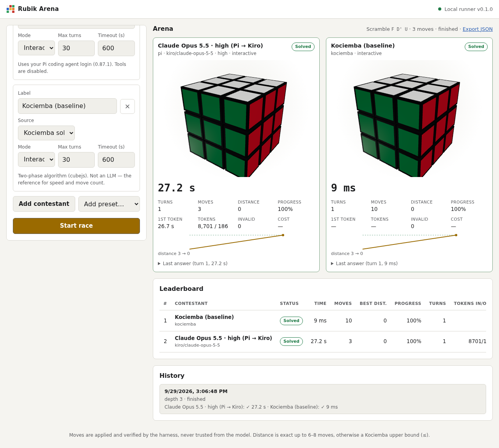
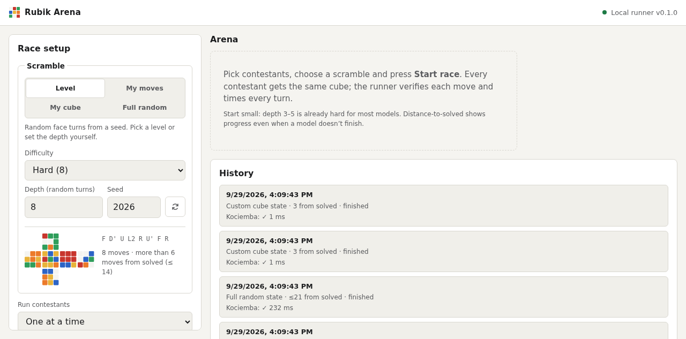
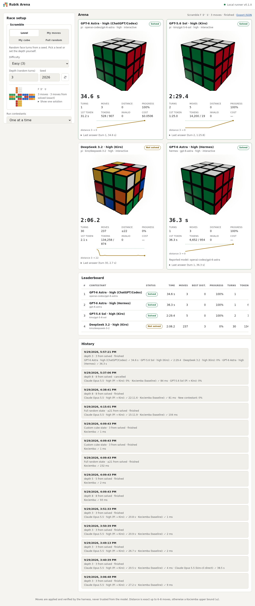

# Rubik Arena

Watch LLMs solve a Rubik's cube in a live 3D dashboard, each with its own timer. Every move is checked by the harness.

Rubik Arena gives several models the same seeded scramble and shows each one working on a 3D cube with a running
timer. You can run the models one after another or in parallel. It records time to solve, time per turn, time to
first token, moves, distance to solved, tokens, and credits or cost.

**Models are reached through CLIs you are already logged into, so no API key is needed:** Pi (which routes to Kiro,
Codex/ChatGPT, Copilot and other providers), and Kiro CLI. API keys (BYOK) and local models through
OpenAI-compatible endpoints (Ollama, OpenRouter, DeepSeek, vLLM) are also supported. Future models work without code
changes: the dashboard reads each CLI's model list, and a new CLI needs one adapter file.







## Quick start

Requires Node ≥ 22.

```bash
git clone https://github.com/Wayan123/AI-Rubik-Solver.git
cd AI-Rubik-Solver
npm install
npm start          # builds the dashboard and starts the local runner on 127.0.0.1:8787
```

Open the link printed in the terminal (`http://127.0.0.1:8787/#token=…`). Pick a preset, for example
**Claude Opus 5.5 · high (Pi → Kiro)**, set a scramble depth (start with 3–5), and press **Start race**.

If the runner isn't running, the dashboard switches to demo mode and only the solver baselines can run. The
Kociemba and random-mover baselines always work, with no login.

Command-line run without the UI (this calls the real model and uses credits):

```bash
npm run test:e2e                                                   # Pi → kiro/claude-opus-5-5, thinking high, depth 3
RUBIK_E2E_DEPTH=5 RUBIK_E2E_SEED=7 npm run test:e2e
RUBIK_E2E_ADAPTER=kiro-cli RUBIK_E2E_MODEL=claude-opus-5.5 npm run test:e2e
```

## Model sources

All of these use a login you already have. **No API key is needed** except for the BYOK row.

| Source | Login used | Example model ids (checked 2026-09-29) |
|---|---|---|
| `pi` → `openai-codex/…` | ChatGPT / Codex subscription (in Pi) | `gpt-6-astra`, `gpt-6-sol`, `gpt-6-luna`, `gpt-5.6-sol`, `gpt-5.6-terra`, `gpt-5.5` |
| `pi` → `kiro/…` | Kiro | `claude-opus-5-5`, `claude-opus-5`, `claude-sonnet-5`, `gpt-5-6-sol`, `gpt-5-6-terra`, `gpt-5-6-luna`, `deepseek-3-2`, `glm-5`, `qwen3-coder-next`, `minimax-m2-5` |
| `pi` → `antigravity/…` | Google Antigravity | `gemini-3.1-pro`, `gemini-3.8-flash`, `claude-opus-4-6`, `gpt-oss-120b` |
| `hermes` | Hermes Agent login (e.g. ChatGPT/Codex, provider `openai-codex`) | `gpt-6-astra`, `gpt-5.6-luna` |
| `kiro-cli` | Kiro | `claude-opus-5.5`, `claude-sonnet-5`, `gpt-5.6-terra` (reports credits) |
| `openai-compatible` | env var named in `apiKeyEnv`, or none for local servers | Ollama (`http://127.0.0.1:11434/v1`), OpenRouter, DeepSeek, vLLM, LM Studio |
| `kociemba`, `random` | none | baselines |

`pi --list-models` shows every model your Pi logins can reach. Pi provider extensions (Kiro, Antigravity, …) are
found automatically from `~/.pi/agent/settings.json`, so a newly installed provider shows up without code
changes. Presets are in [`config/contestants.json`](config/contestants.json) and grouped by login in the
dashboard. To add another CLI, see [docs/adding-a-model.md](docs/adding-a-model.md).

Not usable on this machine right now:

- Codex CLI and Claude Code are not logged in.
- Gemini CLI personal tier was retired by Google; use Antigravity instead.
- The OpenCode free model returned 401.
- Pi's `nvidia/…` models did not answer within 180 s.

## Choosing the scramble

You decide the starting cube. The **Scramble** panel has four sources:

| Source | What you set | Use it for |
|---|---|---|
| **Level** | Difficulty preset (Warm-up 2, Easy 3, Medium 5, Hard 8, Expert 12, Master 20) or a custom depth of 1–100 random turns, plus a seed | Reproducible difficulty ladders |
| **My moves** | Your own move sequence, or a pattern (T-perm, Sune, Checkerboard, Superflip) | Official WCA scrambles, hand-made tests |
| **My cube** | The 54 stickers of a real cube, painted in a sticker editor or pasted as `URFDLB` text | Racing models on the cube in your hand |
| **Full random** | A seed | Uniformly random reachable state, like competition scrambles (hardest) |

Every input is checked before a race starts: allowed moves, 9 stickers per colour, fixed centres, twisted corners,
flipped edges and permutation parity. An impossible cube is rejected with a readable reason. The panel shows the
unfolded start cube and how far it is from solved (exact up to 6 moves, otherwise an upper bound).

API: `POST /api/races` with `scramble: { source: "seeded" | "moves" | "state" | "random-state", seed?, depth?, moves?, state? }`.
Older clients that send only `moves` or `seed`/`depth` still work.

## How a race works

1. You pick the start cube (see above). Every contestant gets exactly the same state.
2. Each model gets the same system prompt (`PROMPT_VERSION v1`). The prompt covers Singmaster notation, an
   unfolded net, a per-face listing and the 54-character facelet string. The model must answer with
   `{"moves": [...]}`.
3. Two modes:
   - **Interactive** (default): the model returns 1–10 moves per turn and receives the new state after each turn.
   - **One-shot**: the model returns the full solution in a single answer.
4. The harness parses and applies every move itself; the model's own claims about the cube are never used. An
   invalid token makes the whole answer invalid. Three invalid answers in a row end the run.
5. **Distance to solved** is exact up to 6–8 moves and a Kociemba upper bound (`≤`) beyond that. It gives a
   progress score, `(initial − best) / initial`, so a model that doesn't finish still gets partial credit. This
   follows Cube Bench (arXiv:2512.20595); CubeBench (arXiv:2512.23328) reports 0% on long-horizon tasks for leading
   LLMs. See [docs/research](docs/research/2026-09-29-landscape.md).

Metrics recorded per run: wall time, latency and time to first token for each turn, turns, moves, invalid answers,
initial, best and final distance, progress, tokens in and out, cost (USD or credits), the reported model, and the
effort level the CLI reports back.

## First results (2026-09-29, this machine)

| Contestant | Scramble | Result | Time | Turns | Moves | Tokens in/out |
|---|---|---|---|---|---|---|
| GPT-6 Astra · high (Pi → ChatGPT/Codex) | seed 2026, depth 3 (`F D' U`) | solved | 34.6 s | 1 | 3 | 528 / 907 |
| GPT-6 Astra · high (Hermes → ChatGPT/Codex) | same | solved | 36.3 s | 1 | 3 | 6 652 / 954 |
| Claude Opus 5.5 · high (Pi → Kiro) | same | solved | 20.5 s | 1 | 3 | 8 540 / 165 |
| Claude Opus 5.5 (kiro-cli, effort reported medium) | same | solved | 38.5 s | 1 | 3 | 0.78 credits |
| GPT-5.6 Sol · high (Pi → Kiro) | same | solved | 149.5 s | 2 | 5 | 14 200 / 19 |
| DeepSeek 3.2 · high (Pi → Kiro) | same | not solved (30 turns) | 126.2 s | 30 | 51 | 134 258 / 874 |
| Claude Opus 5.5 · high (Pi → Kiro) | seed 7, depth 5 (`U B2 D' F D2`) | solved | 873 s | 6 | 47 | 111 935 / 11 319 |
| Claude Opus 5.5 · high (Pi → Kiro) | Hard, seed 109063, depth 8 | solved | 1 332 s | 13 | 99 | 199 319 / 18 254 |
| Claude Opus 5 (Pi → Kiro, default thinking) | same | timed out at 1 800 s (best distance 8) | 1 800 s | 3 | 29 | 132 350 / 21 317 |
| Claude Opus 5.5 · high (Pi → Kiro) | **Full random**, seed 2026 (Kociemba: 21 moves) | solved | 912 s | 10 | 71 | 142 425 / 11 556 |
| Kociemba baseline | seed 2026, depth 3 | solved | 4 ms | 1 | 10 | — |

Each row is a single run (n = 1). The table shows the pipeline works; it is not a ranking. GPT-5.6 Sol's first turn
made a wrong move, which it corrected on turn 2. DeepSeek 3.2 used all 30 turns: it applied 237 moves, got within
3 moves of solved, but never finished.

With state feedback in interactive mode, Claude Opus 5.5 solved even a fully random cube. The literature reports
0% on long-horizon one-shot tasks, so the interactive result shows how much per-turn feedback matters; single runs
cannot quantify the effect.

## Security model

- The runner listens on **127.0.0.1 only**. Each launch creates a random bearer token that every `/api/*` call must
  send. A Host-header check blocks DNS-rebinding attacks. No CORS headers are sent. A strict CSP is set.
- CLIs are started **without a shell** (arguments passed as an array) in a fresh empty temp directory, with tools
  disabled:
  - Pi: `--no-tools --no-skills --no-context-files --no-extensions --no-session`
  - Kiro: `--trust-tools=`. An answer that attempted a tool call is rejected.
  - Hermes: `-t clarify`. An empty `-t ""` falls back to your configured tools; in a test that config wrote a
    file into `$HOME`.

  Flags such as `--yolo`, `--trust-all-tools` or `--dangerously-*` are never used. A timeout or cancel sends
  SIGTERM, then SIGKILL.
- API keys never reach the browser. Presets and requests hold only the env var name (`apiKeyEnv`). Option keys that
  look like secrets are rejected.
- Race logs are written to `data/`, which is gitignored. They contain raw model answers.

Details: [SECURITY.md](SECURITY.md).

## Project layout

```
packages/cube-engine   facelet model, moves, scramble, exact/bounded distance, Kociemba wrapper
packages/bench-core    prompt, parser, run loop (timers, limits, cancel), race, ranking
packages/adapters      pi, kiro-cli, openai-compatible, baselines; spawnCli sandbox helper
apps/runner            Fastify server: auth, SSE live events, JSON race store, serves the dashboard
apps/web               React + react-three-fiber dashboard, demo mode in the browser
config/                contestant presets
docs/                  BMAD brief, research, design spec, implementation plan, how-to docs
scripts/e2e-pi.ts      opt-in live run against a real model
```

## Development

```bash
npm run dev          # runner with reload (port 8787)
npm run dev:web      # Vite on 127.0.0.1:5173, proxies /api using data/.runner-token
npm run check        # biome lint + tsc -b + vitest + build (same as CI)
```

The spec is in [docs/superpowers/specs](docs/superpowers/specs/2026-09-29-rubik-arena-design.md). Contributions
are welcome; see [CONTRIBUTING.md](CONTRIBUTING.md).

## License

MIT. Uses [cubejs](https://github.com/ldez/cubejs) (MIT) for the two-phase solver.
